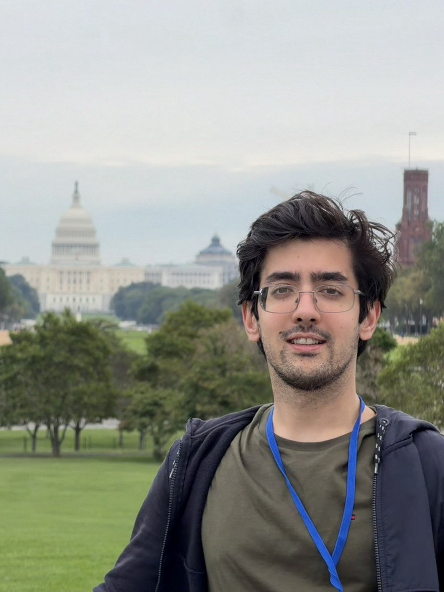

:::: {.grid}
::: {.g-col-4}

:::
::: {.g-col-8}
I am a PhD student in the **School of Computer Science** at **Carnegie Mellon University** (Computational Biology Department), advised by **Dr. Jose Lugo-Martinez**.

My research focuses on **machine learning**, **generative and foundation models**, **reinforcement learning**, and **agentic systems**, with applications to automated science and computational biology. I am interested in ML methods and systems that support reliable reasoning, decision-making, simulation, and scientific discovery.

I am seeking **Summer 2027 research internships** in machine learning, generative AI, agentic systems, ML systems, and AI for science.

::: {.callout-note}
I value **robust baselines**, **reproducible code**, and **clear methods** that can be understood by both ML researchers and domain scientists.
:::

## Education

- **Ph.D. Computational Biology** — School of Computer Science, Carnegie Mellon University (2024–2029)  
  Advisor: Dr. Jose Lugo-Martinez
- **M.Sc. Computer Engineering** — Bilkent University (2021–2024, GPA: 3.9/4.0)  
  Advisor: Dr. A. Ercument Cicek · Thesis: Generative Models for Generating and Optimizing Biological Sequences
- **B.Sc. Computer Engineering** — Shiraz University (2016–2021, GPA: 3.5/4.0)

## Research Highlights

- **Lab Automation / MHS:** Led CMU's work using the Model Hardware Standard in the research preview, including drivers and orchestration so an AI agent could operate a liquid handler, plate reader, and robotic arm
- **Agentic Systems:** RL and LLM agents for autonomous orchestration and fault recovery
- **Simulation & Benchmarking:** CloudBench — simulator and benchmark generator for programmable cloud laboratories
- **ML Systems:** Extending FlashAttention and PagedAttention in MiniTorch (LLM Systems coursework)
- **Generative Models:** Sequence design with GANs and seq2seq models (UTRGAN, RNAtranslator)
- **Reinforcement Learning:** Policy optimization for biomarker discovery under structure-aware rewards
- **Representation Learning:** Evolution-informed protein subgraph features for downstream prediction

## Recent News

- **Aug 2026:** We used the [Model Hardware Standard (MHS)](https://www.anthropic.com/news/model-hardware-standard-research-preview) in the research preview (announced by Anthropic) so an AI agent could operate a liquid handler, plate reader, robotic arm, and cameras. Serial-dilution dose-response experiments ran ~3× faster. I led this work at CMU. [Read the post.](posts/2026-08-27-mhs-preview.qmd) Also covered by [CMU SCS on LinkedIn](https://www.linkedin.com/feed/update/urn:li:ugcPost:7498829877215842304/?actorCompanyId=28172194) and [X](https://x.com/SCSatCMU/status/2093063825171853484).
- Attending [AI Scientist Summer Workshop](https://ai-scientist-workshop.github.io/#about) at Cambridge, MA — Microsoft Research (Aug 2026); contributed talk: *Agentic Fault Recovery for Autonomous Orchestration of Programmable Cloud Laboratories*
- Attending SciFM (Chicago IL, 2026)
- Two publications in 2025: PLOS Computational Biology and Bioinformatics Advances
- Attending SenNet Annual Meeting (Washington DC, 2025) and PathVisions (San Diego, 2025)
- Now seeking Summer 2027 research internships

See my [projects](projects.qmd), [publications](publications.qmd), and [CV](cv.qmd) for more details.
:::

::::
