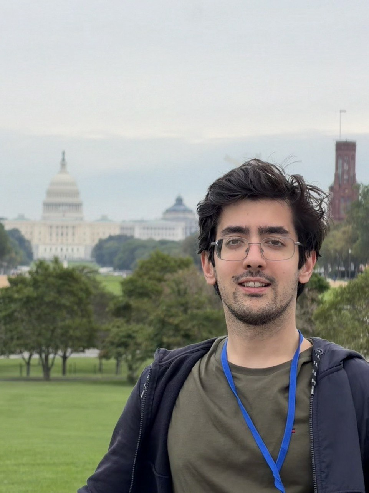

:::: {.grid}
::: {.g-col-4}

:::
::: {.g-col-8}
I am a PhD student in the **School of Computer Science** at **Carnegie Mellon University** (Computational Biology Department), advised by **Dr. Jose Lugo-Martinez**.

Most recently, I led CMU's work using the [Model Hardware Standard (MHS)](posts/2026-08-27-mhs-preview.qmd) in the limited research preview: I built instrument drivers and orchestration so an AI agent could coordinate a liquid handler, plate reader, robotic arm, and cameras for closed-loop dose-response experiments. [*Nature* covered the work](https://www.nature.com/articles/d41586-026-02990-8) on 24 September 2026.

I am seeking **Summer 2027** research and applied-science internships in agentic scientific discovery, autonomous laboratories, generative AI, reinforcement learning, and ML systems.

[[Resume (PDF)]](files/Sina_Barazandeh_Resume.pdf) · [[Academic CV (PDF)]](files/Sina_Barazandeh_CV.pdf)

## Education

- **Ph.D. Computational Biology** — School of Computer Science, Carnegie Mellon University (2024–2029)  
  Advisor: Dr. Jose Lugo-Martinez
- **M.Sc. Computer Engineering** — Bilkent University (2021–2024, GPA: 3.9/4.0)  
  Advisor: Dr. A. Ercument Cicek · Thesis: Generative Models for Generating and Optimizing Biological Sequences
- **B.Sc. Computer Engineering** — Shiraz University (2016–2021, GPA: 3.5/4.0)

## Research Highlights

- **Autonomous Laboratories / MHS:** Drivers and orchestration for a liquid handler, plate reader, robotic arm, and cameras. [Case study](posts/2026-08-27-mhs-preview.qmd)
- **Simulation & Benchmarking:** simPCL, a simulator and benchmark generator for planning and fault recovery in programmable cloud laboratories. I am interested in sim-to-real transfer, reinforcement learning in MuJoCo, and 3D world models for laboratory simulation.
- **Generative Models:** Sequence design with GANs and seq2seq models (UTRGAN, RNAtranslator, RNAGEN)
- **Reinforcement Learning:** Policy optimization for biomarker discovery under structure-aware rewards
- **ML Systems:** FlashAttention and PagedAttention in MiniTorch (LLM Systems coursework)

## Recent News

- **Sep 2026:** *Nature* News covered the MHS work: [AI system helps lab devices 'talk' with each other — streamlining research](https://www.nature.com/articles/d41586-026-02990-8). The article opens in our lab and describes the team’s work with Jose Lugo-Martinez.
- **Sep 2026:** Presented the poster *Agentic Recovery for Orchestration of Programmable Cloud Laboratories* at [2026 Predictive Phenomics](https://pnnl.cventevents.com/event/b1510a8f-c5a0-4ae7-bd74-23a2cc86873a/agenda), Washington, DC (September 22–24).
- **Aug 2026:** Anthropic’s [MHS research preview](https://www.anthropic.com/news/model-hardware-standard-research-preview) included this deployment. Serial-dilution dose-response experiments ran ~3× faster. I led the work at CMU. [Read the post.](posts/2026-08-27-mhs-preview.qmd) Also covered by [CMU SCS on LinkedIn](https://www.linkedin.com/feed/update/urn:li:ugcPost:7498829877215842304/?actorCompanyId=28172194) and [X](https://x.com/SCSatCMU/status/2093063825171853484).
- Contributed talk at the [AI Scientist Summer Workshop](https://ai-scientist-workshop.github.io/#about), Microsoft Research, Cambridge, MA (Aug 2026): *Agentic Fault Recovery for Autonomous Orchestration of Programmable Cloud Laboratories*
- Poster on simPCL at SciFM 2026 (Chicago, IL)
- Publications in 2025 (*PLOS Computational Biology*, *Bioinformatics Advances*) and RNAGEN in *ChemBioChem* (2026)
- Attended the SenNet Annual Meeting (Washington, DC, 2025) and PathVisions (San Diego, 2025)

See my [projects](projects.qmd), [publications](publications.qmd), and [CV](cv.qmd) for more details.
:::

::::
