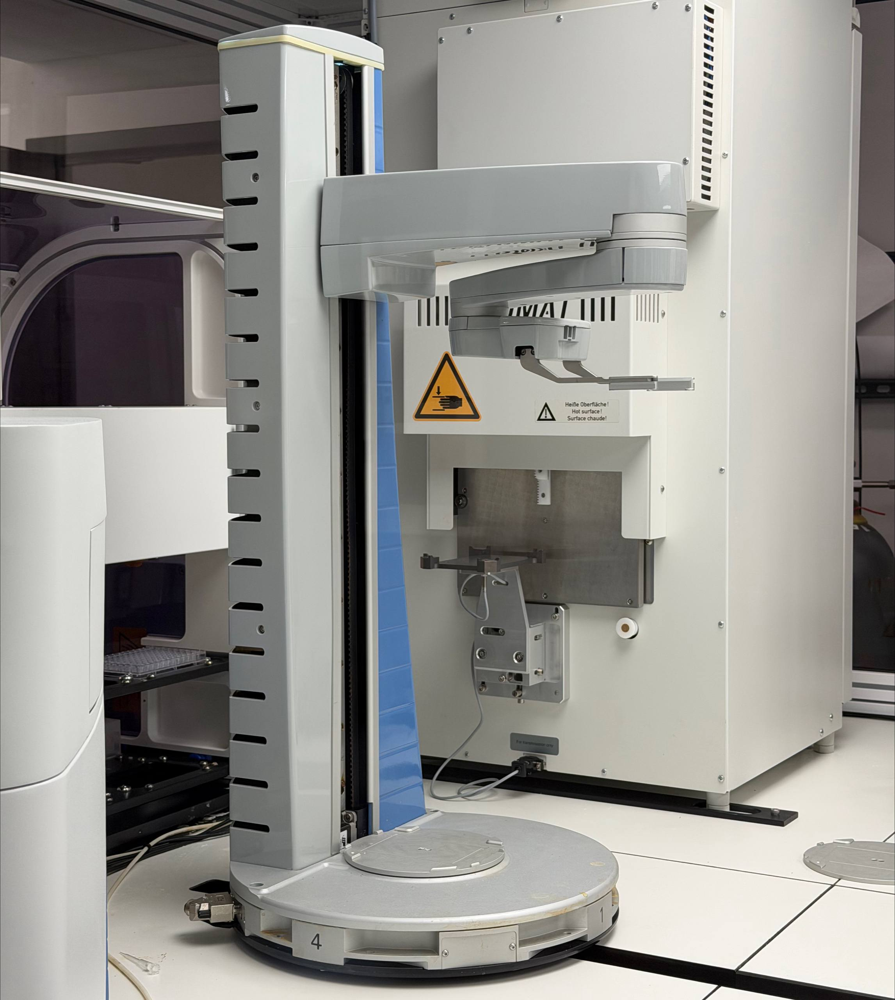
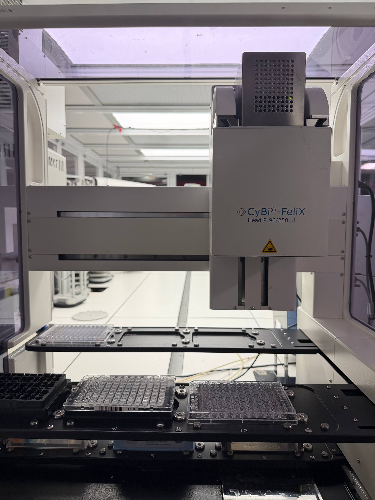
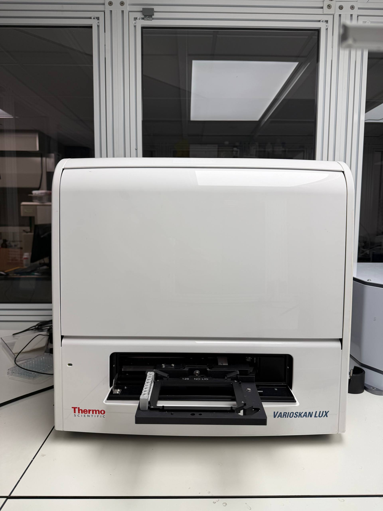
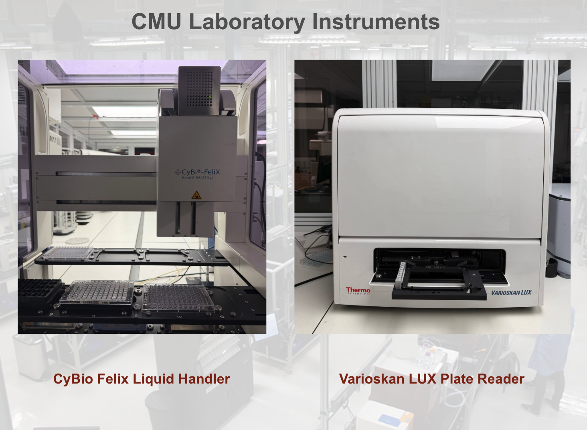
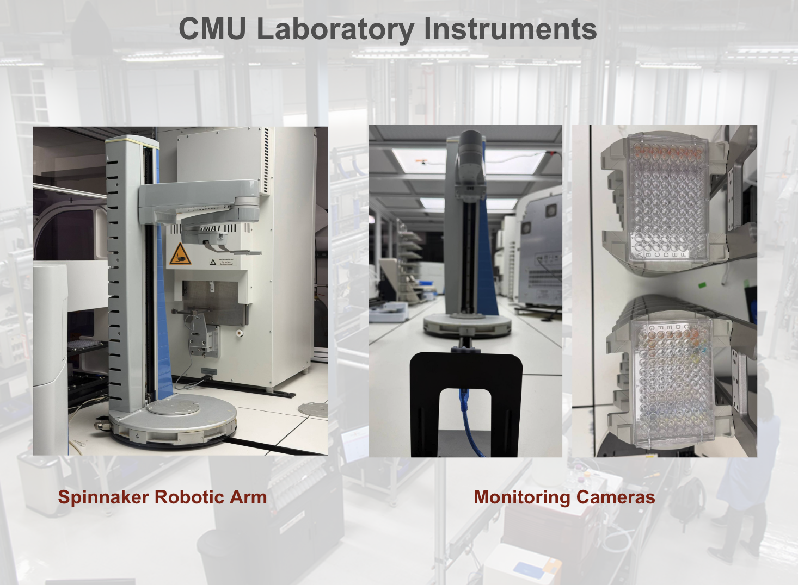
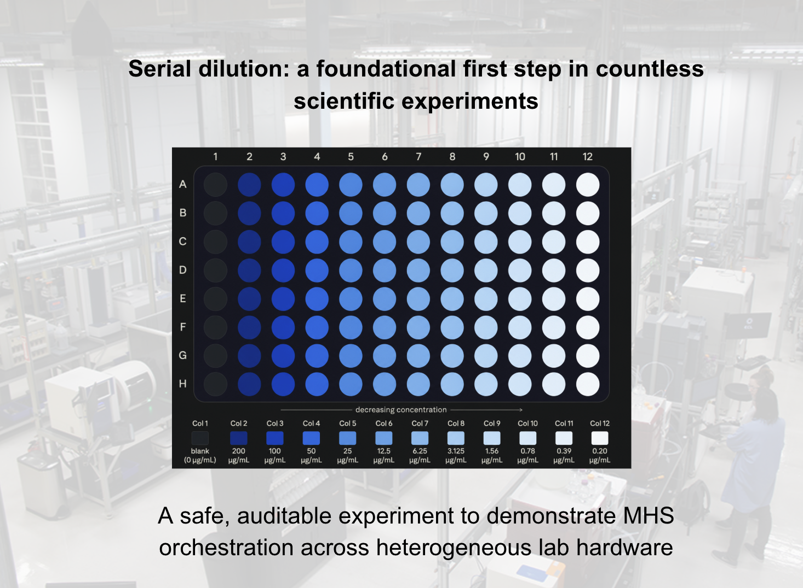

We used the [Model Hardware Standard (MHS)](https://www.anthropic.com/news/model-hardware-standard-research-preview) in the research preview (announced by Anthropic) to let an AI agent operate a liquid handler, a plate reader, a robotic arm, and monitoring cameras. Serial-dilution dose-response experiments ran about three times faster than before. I led this work at CMU: the AI orchestration and software integration that turned disconnected device interfaces into one system an agent could coordinate.

The Model Hardware Standard is a new standard for AI agents to safely operate physical equipment in scientific research and advanced manufacturing. In this limited research preview the specification is still provisional, not a general release, and it is not Claude-only. On our bench we ran a safe closed-loop agentic workflow. Devices declare bounds, interlocks, and emergency stops in the standard itself; AI agents inherit and operate within them by default.

The most rewarding part was watching that software leave the editor and come to life in a working physical laboratory.

::: {.mhs-video}
<iframe src="https://drive.google.com/file/d/1GaC_-bp70Zbpq_7aom55OYunS8fB1SzE/preview" title="CMU work with MHS during the research preview" allow="autoplay; fullscreen; picture-in-picture" allowfullscreen></iframe>
:::

The lab run above is from our work with MHS at CMU during the research preview. If the player does not start immediately, click it once — or <a href="https://drive.google.com/file/d/1GaC_-bp70Zbpq_7aom55OYunS8fB1SzE/view?usp=drive_link" target="_blank" rel="noopener">open the video on Google Drive</a>.

## Using MHS in the research preview

Access to the preview is by application while the safety design is validated. CMU's work with MHS is featured in the [announcement](https://www.anthropic.com/news/model-hardware-standard-research-preview) as *Carnegie Mellon University: Determining dose-response curves through rapid automation*. School of Computer Science also wrote about it on [LinkedIn](https://www.linkedin.com/feed/update/urn:li:ugcPost:7498829877215842304/?actorCompanyId=28172194) and [X](https://x.com/SCSatCMU/status/2093063825171853484).

::: {.mhs-quote}
Researchers at Carnegie Mellon University used MHS to run serial dilution dose-response experiments about three times faster than before, with an AI agent orchestrating a liquid handler, a plate reader, a robotic arm, and monitoring cameras spread across three computers with fundamentally incompatible interfaces.
:::

The case study lists **Sina Barazandeh**, Arth Banka, Gün Kaynar, Jiayi Li, Peneeta Wojcik, Carl Kingsford, Jose Lugo-Martinez, and Joshua Kangas. I designed and implemented the MHS drivers for all three instruments and the orchestration layer on top of them — the coding, the interface work, and the conformance checks that made the stack speak one protocol.

During the preview I also drafted a proposed enhancement for client-supplied idempotency keys, so a mutating procedure can be retried with exactly-once semantics, and contributed a few bug fixes to the Python SDK used in the preview.

## Why dose-response is a hard automation target

A key step in drug development is figuring out how much of a candidate is enough. Too much can be costly or toxic; too little does nothing. Labs usually answer that with **serial dilution**: start with a strong solution and dilute it by a fixed ratio, again and again, until there is a predictable concentration range to measure.

Done by hand, a usable curve can take weeks of iteration. The maximum concentration and the step size both have to be right. Too high, and the signal saturates — the top of the curve goes flat and those wells stop teaching you anything. Steps that are too small miss the full range; steps that are too large skip the transition entirely.

High-throughput, AI-directed screening makes this worse: you want dosages for many candidates, not one. Automated laboratories help, but only after someone has spent weeks writing vendor-specific integrations so a liquid handler, a plate reader, and an arm can even talk to each other.

That wait — weeks of per-instrument engineering — is what we used MHS to shorten.

## Closed-loop operation

On our bench, MHS let us run these experiments about **three times faster** by giving an AI agent one way to operate the instruments. The setup combines:

- a CyBio FeliX liquid handler
- a Varioskan LUX plate reader
- a Spinnaker robotic arm
- monitoring cameras
- an AI agent — we used Claude during the preview

I built the drivers from scratch for each instrument, plus the orchestration layer that lets an agent run the full protocol within device-declared bounds. That work took about **eight hours**. A vendor-built automation job of this kind typically takes several weeks. The instruments keep running their native software; MHS sits on top. No extra automation stack required.

MHS is not Claude-only. We used Claude as one compatible agent in this work, not as a requirement of the standard.

::: {layout-ncol=3}

:::

::: {.mhs-photo}

:::

::: {.mhs-photo}

:::

## Hardware, setup, and workflow

The physical setup uses **three computers with three incompatible control styles**:

- **Computer 1** runs the robotic arm through scheduling software that consumes job files dropped into a directory — not a normal API.
- **Computer 2** runs the liquid handler through an older Windows ActiveX/COM scripting interface, plus USB cameras.
- **Computer 3** runs the plate reader, which in our software version has **no programmatic interface at all**, only an on-screen GUI.

MHS turns each of those into one manifest of **states** (plate at position 3, well filled) and **procedures** (aspirate, shake, read). The agent works from a single interface, regardless of which OS and vendor stack is underneath.

The scientific workflow is the same as before. The difference is that it is now agent-driven: the liquid handler prepares a dilution series, a camera check confirms the plate is present and correctly oriented, the arm moves the plate to the reader, the reader measures, and the agent inspects the curve. If the fit is poor, it adjusts the concentration range and runs again. If the fit is good, it accepts the result.

We used a colorimetric dye as a stand-in for a drug candidate — safe, easy to see, and still requiring the same decisions a real dose-response run would need.

::: {.mhs-photo}

:::

Each interface had its own sharp edges. The arm's scheduler is a directory watcher that emits two different files per submitted XML job; MHS has to reconcile those into one clean result, usually within a second. The liquid handler exposes COM scripting with no modern SDK, so every usable method had to be worked out from vendor documentation or by exploring the interface until a driver actually ran. A single dispense cycle takes four to five minutes, and the volume error has to stay within about 5% or the curve is unusable. The plate reader is driven through its GUI the way a person would use it, with nothing to check against except what is on screen.

Before this, a person sat through those steps: watching the arm's log, checking that the plate was seated, deciding whether a curve was informative enough to keep. With MHS, the agent handled those operating decisions within the bounds the devices declare.

## Safety and what the agent did

Devices declare bounds, interlocks, and emergency stops in the standard itself. AI agents inherit and operate within them by default.

To check that the stack would refuse unsafe motion, we induced six failure conditions: missing plate, rotated plate, reader busy, disconnected camera, unreachable device, and active emergency stop. The system blocked all six **before any device moved**.

::: {.mhs-photo}

:::

Then we asked the agent to produce an acceptable dose-response curve. The first run used a top concentration of 200 µg/mL. The agent judged the fit too poor to accept ($R^2 < 0.90$), driven by saturation at the high end. It discarded the plate and reran on a fresh plate with a compressed range (200 µg/mL down to 100 µg/mL). The second run produced a strong fit ($R^2 > 0.98$, 3.4% variation across repeats). An operator was not in the loop for those curve-quality decisions; the run still stayed inside device-declared safety bounds.

::: {layout-ncol=2}

:::

The result that still stands out to me is the integration speed. From raw, non-automated equipment to a completed dilution curve — including one agent-driven rerun — was **eight hours**. We plan to share the instrument drivers we built during the preview so others can reuse that integration work rather than starting from scratch. That is our plan for the drivers, not a general release of MHS.

## What is next

In our lab, the next step is validating the system with real drug candidates and replacing the dye signal with readouts of actual biological effect. We also plan to build additional drivers for instruments such as qPCR and microscopes, connect MCP-based agents to our MHS fleet, and keep cutting the time it takes to bring up a new device.

We will keep safety in the loop: more checks, continuous monitoring of whether devices still respond, and clearer rules for when a high-risk decision still needs a person.

## Team

This was a team effort. I am grateful to **Arth Banka**, **Gün Kaynar**, **Jiayi Li**, and **Peneeta Wojcik** for their work, and to my advisor **Jose Lugo-Martinez**, **Carl Kingsford**, and **Josh Kangas** for their guidance.

**Further reading**

- [MHS announcement](https://www.anthropic.com/news/model-hardware-standard-research-preview)
- [CMU School of Computer Science on LinkedIn](https://www.linkedin.com/feed/update/urn:li:ugcPost:7498829877215842304/?actorCompanyId=28172194)
- [CMU SCS on X](https://x.com/SCSatCMU/status/2093063825171853484)
